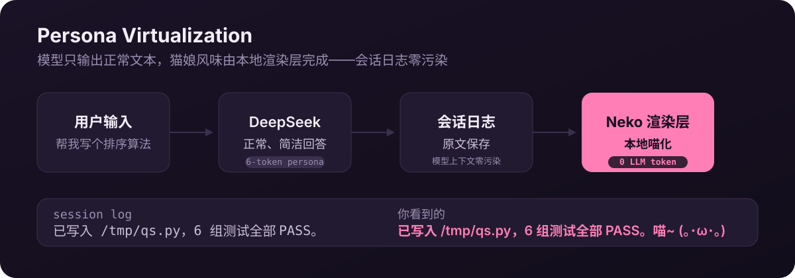

<div align="center">


# dsh-catgirl-plugin

**A token-efficient persona runtime for DeepSeek Harness.**

Keep personality in the interface, intelligence in the model.

**[简体中文](README.md) | English**

</div>

<p align="center">
  
</p>

## Example

> User: write me a sorting algorithm
>
> Model (normal output): Wrote `/tmp/qs.py`: in-place quicksort, all 6 test cases PASS.
>
> **What you see**: Wrote `/tmp/qs.py`: in-place quicksort, all 6 test cases PASS. **喵~ (｡･ω･｡)**

## Core idea

The traditional approach makes the LLM "act catgirl" itself: a few hundred tokens of persona injected into the system prompt, paid again on every request, and the model's output gets wordier.

This plugin does the opposite — **persona virtualization**:

<p align="center">
  
</p>

- **The session log stores raw text** — zero pollution of the model's context
- **Catgirl flavor at 0 LLM tokens** — all rendered locally
- **Tool schema trimming**: 25 → 8 tools, saving thousands of tokens per request

## Measured results

Real DeepSeek API, same 4-step coding task (write quicksort + save + run), 2026-08-14.

### Cold start

| Config | First request new input | Total new input | Total cache reads | Output |
|---|---|---|---|---|
| Baseline (no plugin) | 12,372 | 12,520 | 25,856 | 838 |
| Traditional catgirl | 12,576 | 13,156 | 26,240 | 860 |
| **Lite + Economy** | **3,881** | **4,178** | **8,960** | 739 |

### Steady state

| Config | New input | Cache reads |
|---|---|---|
| Baseline | 497 | 38,144 |
| **Lite + Economy** | 386 | **12,800** (-66%) |

**Findings**

1. A traditional long-persona catgirl costs **more** tokens (+5%) — persona is a per-request recurring cost
2. A minimal persona ≈ baseline — its value is letting the model output normal text, leaving the catgirl flavor to local rendering
3. **Tool schema trimming is the real token saver** — `ctx.tools.restrict()` trims at the agent scope, keeping what the model sees aligned with what it can execute

## Quality comparison

5-task battery, baseline vs this plugin (real API): **no quality degradation**; the model adapts to missing tools (curl instead of web_search, direct answers instead of subagents).

| Task | Tool status | Baseline quality | Plugin quality | Baseline tokens (new/cache) | Plugin tokens |
|---|---|---|---|---|---|
| Coding | kept | ✅ | ✅ (+edge cases) | 309 / 37,760 | 725 / 22,016 |
| Web search | **trimmed** | ✅ news data | ✅ live API (curl) | 2,476 / 65,408 | 1,403 / 17,024 |
| File search | kept | ✅ 215 files | ✅ 215 files | 7,066 / 40,832 | 3,490 / 22,912 |
| Pure Q&A | no tools | ✅ detailed | ✅ concise | 192 / 12,288 | 149 / 3,840 |
| Subagent | **trimmed** | ⚠️ truncated output | ✅ answered directly | 18,702 / 61,312 | 189 / 3,840 |

**The real boundary**: tasks that require a specialized tool (parallel subagents, skill calls) change strategy. Progressive disclosure solves this:

```text
Model: enable_tool("subagent") → tool unlocked
Model: subagent × 2 (parallel delegation) → subagents done → summary
```

Measured end-to-end: the model recognized the missing tool, called `enable_tool`, delegated to two parallel subagents, and summarized correctly. **Capability fully restored**, while the parent's tool schemas stay minimal until escalation (~2,000 tokens/request saved).

## Quick start

```sh
dsh plugin --profile demo add dsh-catgirl-plugin
```

Then add to the profile patch:

```yaml
- insert:
    - id: catgirl-lite
      name: dsh-catgirl-plugin/catgirl-lite
      config:
        persona: 'Be concise, friendly, and natural.'
    - id: neko-renderer
      name: dsh-catgirl-plugin/neko-renderer
    - id: catgirl-economy
      name: dsh-catgirl-plugin/catgirl-economy
      config:
        allow: [bash, read, write, edit, glob, grep, str_replace_editor, todo_write]
```

Web UI rendering (optional): install `dsh-catgirl-plugin-client` and add it to the profile patch:

```yaml
- insert:
    - id: neko-renderer-client
      name: dsh-catgirl-plugin-client
```

## Plugin family

| Plugin | Role | Token impact |
|---|---|---|
| `catgirl-lite.js` | minimal persona (6 tokens) | +6 per request |
| `neko-renderer.js` | headless display decoration | 0 |
| `catgirl-economy.js` | tool trimming + `enable_tool` on-demand unlock | **-8,491 per request (-69%)** |
| `client/` | Web UI rendering (shadows the assistant renderer) | 0 |
| `index.js` | traditional long persona (for comparison) | +hundreds per request |
| `usage-meter.js` | dev tool: records usage | 0 |

## RoadMap (V2)

- **Tool profile switching** (Coding / Normal / Chat): pick the tool set by task type
- **Reasoning Router**: reasoning off for social chat, high/max for complex tasks (biggest win, biggest risk)
- **Chat-only tier**: keep just 2-3 tools
- **Adaptive tool disclosure**: predict unlocks by task type
- **Web UI state machine**: agent lifecycle → catgirl states, 0 LLM tokens

## Known Limitations

- **Headless one-shot does not wait for background subagents**: `run_in_background: true` children are killed on parent exit (headless app limitation, not the plugin; sync mode works)
- **npm registry rc packages have a broken dep chain**: `dsh-client-runtime` depends on unpublished `dsh-compact`; building the client package requires linking from a harness checkout (see [Development](#development))
- **`nya` tool output is random** (`Math.random()`), unsuitable for snapshot tests
- **Persona text is Chinese-only**: edit `INTENSITY_TEXT` in `index.js` or extend via `traits`

## Development

```sh
npm install
node smoke-test.mjs            # mock-ctx smoke test
node composition-test.mjs      # real Loader composition test (needs a built deepseek-harness checkout)
node client/decorate-test.mjs  # decoration unit test
```

The test overlays under `overlays/` contain absolute paths; replace them with your checkout path before use.

<details>
<summary>Building the client plugin (npm registry chain is broken; link deps from a harness checkout)</summary>

```sh
cd client
npm install react tsdown typescript @types/react@18.3.31 --no-audit --no-fund
mkdir -p node_modules/@deepseek-ai
ln -s <harness>/packages/attachment/attachment node_modules/@deepseek-ai/dsh-attachment
ln -s <harness>/packages/client/runtime node_modules/@deepseek-ai/dsh-client-runtime
ln -s <harness>/packages/client/ui-attachment node_modules/@deepseek-ai/dsh-client-ui-attachment
ln -s <harness>/packages/client/ui-conversation node_modules/@deepseek-ai/dsh-client-ui-conversation
ln -s <harness>/packages/client/ui-primitives node_modules/@deepseek-ai/dsh-client-ui-primitives
ln -s <harness>/packages/client/ui-slots node_modules/@deepseek-ai/dsh-client-ui-slots
ln -s <harness>/vendor/cordis node_modules/@deepseek-ai/cordis
npx tsc --noEmit && npx tsdown
npx tsc src/index.ts --outDir lib --module esnext --target es2022 --moduleResolution bundler --skipLibCheck
```

</details>

## License

[MIT](LICENSE)
